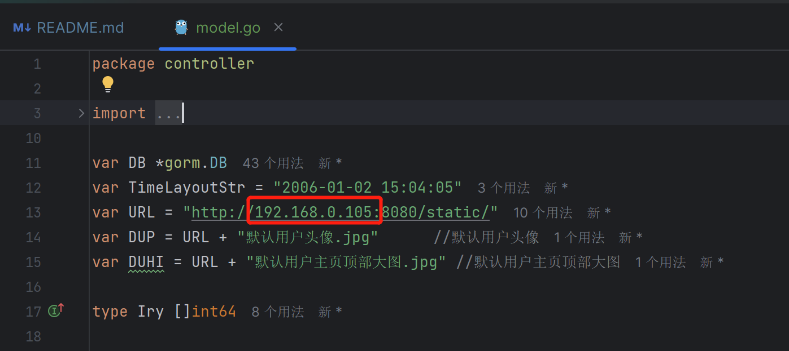

# 简易抖音

### 版本
go 1.17 
MySQL 8.0
### 获取第三方包
    go get -u github.com/u2takey/ffmpeg-go
    go get -u github.com/disintegration/imaging
    go get -u github.com/gin-gonic/gin
    go get gorm.io/driver/mysql
    go get gorm.io/gorm
### 改IP

将dy/controller/model 里红色框的ip改为自己电脑的ip地址
### 启动
直接运行 main.go 即可